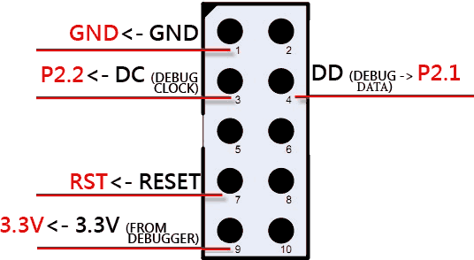

# 亿慧云Zigbee

1. 产品实物图（完善中）
2. 四开开关（完善中）
3. 情景开关（完善中）
4. 窗帘开关（完善中）
5. 刷机工具
6. 刷机教程
7. 接入HomeAssistant（完善中）
8. CC2530相关
9. 交流

## 产品实物图

## 四开相关

## 情景开关

## 窗帘开关

## 刷机工具

1. CC-Debugger调试器  
2. 软件[Texas Instruments SmartRF Flash Programmer](https://www.ti.com/tool/FLASH-PROGRAMMER) 非V2版

## 刷机教程

如上图，打开SmartRF Flasher Programmer，步骤3中选择固件（.hex）结尾，步骤Perform actions刷机。

## 接入HomeAssistant

## CC2530相关

## 交流

[点击链接加入群聊【微管家App】](https://jq.qq.com/?_wv=1027&k=vNt1J2FT)728198774

